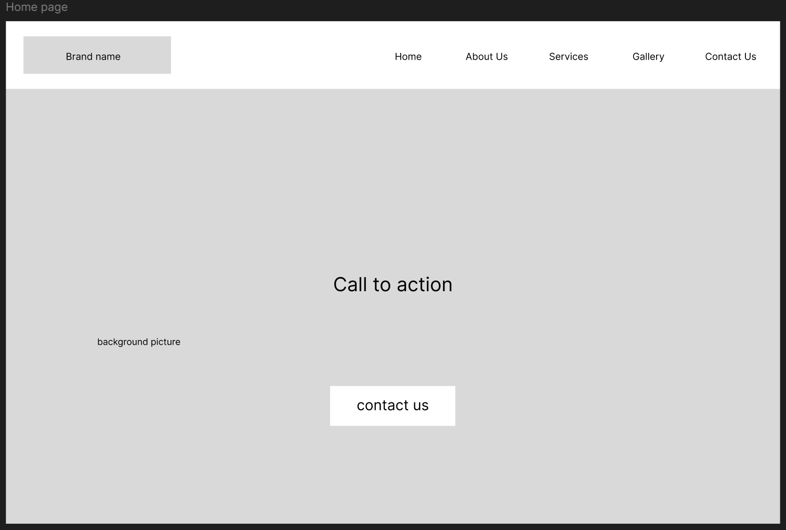
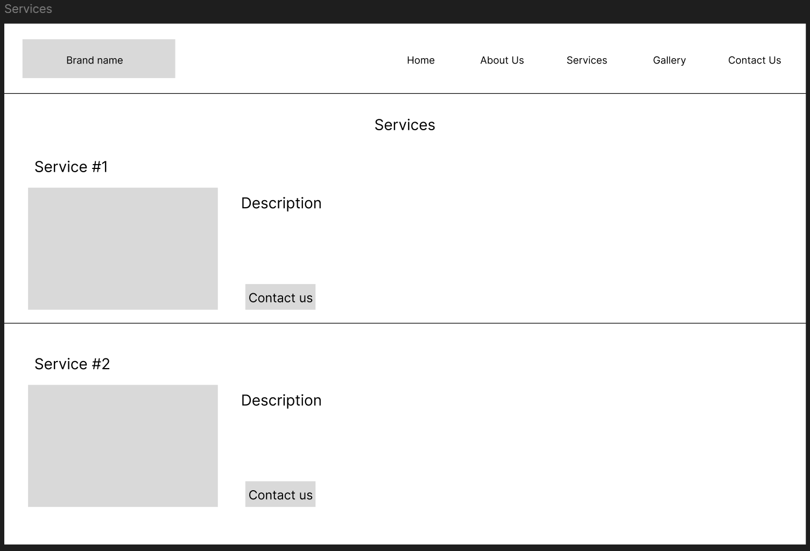
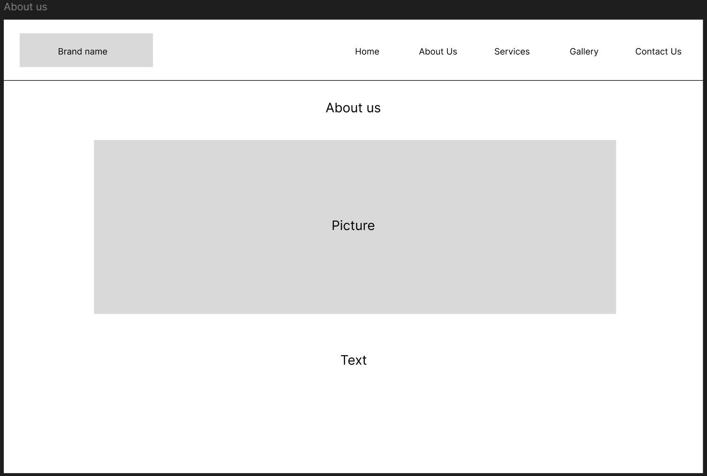
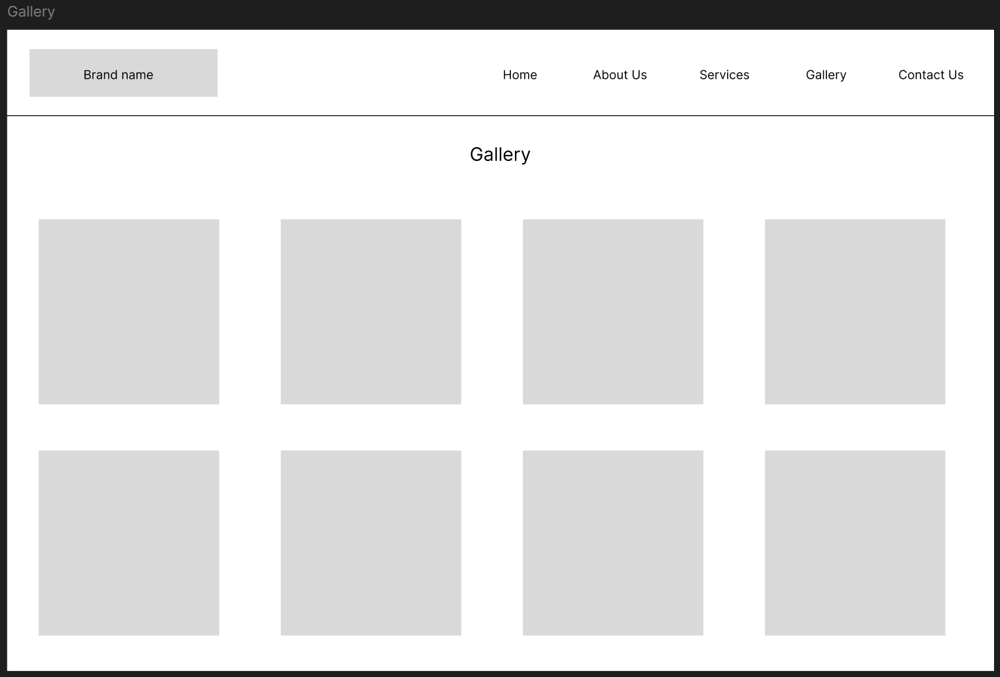
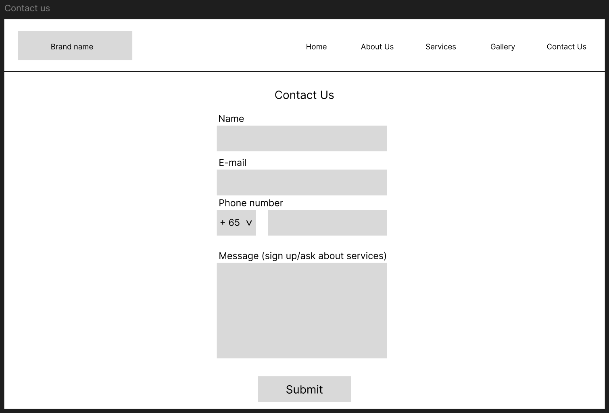

# Bikes SG
Bikes SG is a company that provides reliable maintainance services for a wide range of bikes. Their website aims to provide
a satisfiable user experience by showcasing their products, services and brand identity to its customers. Some of the 
services which are included are: tyre and brake servicing, bike frames and chain servicing, and handlebar replacement. 

Design Process
To help Bikes SG meet their goals and showcase their brand and wide range of products/services, I have decided to create a
website that has 4 pages:
1. The home page, where users are greeted with a call to action to explore the Bikes SG.
Some ideas include having a video/image that represents the brand on this page so that users have a good first impression.
2. The services page, where users get to learn about the variety of services that Bikes SG provides, and can easily decide 
which service they are looking for. 
-->There should also be a hyperlink that brings users to the Contact Us page so they can place an appointment/ask any 
questions about a service conveniently.
3. The about us page, which showcases the reliability and customer-centeric goals of Bikes SG, aiming to spread the brand 
culture and identity of Bikes SG. 
-->This page should have a clean layout that includes the use of pictures/videos that makes
the storytelling process easier to understand for them.
4. The gallery page, which shows pictures of Bikes SG staff carrying out various services on bikes, and showcase famous 
clients who are frequent customers of Bikes SG.
-->This page aims to give users a sense of trust and an idea of what they are looking for in a bike servocing company, by
highlighting the reliable services that offers high customer satisfaction.
5. The contact us page, where users fill out a form with their name, email, phone number and a message that indicates which
service they want to arrange, or any queries they have about any products/services.
-->By keepimng th form short and with minimun details,users should be able to complete the form in a short amount of time.
After that, by contacting them through their personal details, it provides a more personal and 1 to 1 customer experience.

Wireframe
link: https://www.figma.com/design/uOqgd2D4WIUMzQ5vOQGS8a/FED-wireframe?t=NXPZaUD9PXUFKnvw-0

1. Home page
As a first-time user, I want to know what Bike SG is about, so that I can decide whether or not to continue browsing their 
website. (The call to action will encourage them to explore more of the website)
As a frequent user, I want to arrange a servicing, so that I can repair my bike quickly. (The hyperlink brings them to the
contact us page for easy bookings)

2. Service page
As a first-time user/user who wants to try out a new service, I want to browse and learn more about the various services 
provided by Bikes SG, so that I can decide whether I want to service my bike through Bikes SG. (the in-depth description of 
the services accomplishes this)
As a frequent user, I want to go to the service that my bike requires and arrange that booking on the spot, so that I can 
service my bike quickly. (The hyperlink brings them to the contact us page for easy bookings)

3. About Us page
As a first-time user, I want to see what makes Bikes Sg different/better than other brands, so that I can decide whether to
service my bike through them or other competitors. (The images and descriptions will showcase Bikes SG's brand identity)
As a frequent user, I want to learn more about Bikes SG's brand culture and what makes them unique, so that I can trust 
them to service my bike. 

4. Gallery page
As a first-time user, I want to learn more about Bikes SG's achievements, how they service bikes, and who uses Bikes SG to
service their bikes, so that I can decide whether I want to service my bike through Bikes SG. 
As a frequent user, I want to see some of Bikes SG's famous clients, so that I can feel satisfied that I am receiving the 
same service that are given to some of the top cyclists in Singapore.

5. Contact Us page
As a first-time user, I want to ask some questions about their services, so that I know what is being offered and decide 
whether to arrange a service with Bikes SG.
As a frequent user, I want to quickly arrange the usual service, so that I can get through the usual servicing routine
easily and conveniently.

Features
- Navigation bar that changes colour on hover (completed)
- Video in background on homepage
- Outline the services provided
- Include fictional track record and achievements
- Include pictures in a flexbox 
- Provide information and contact information for customers.
- Error handling for form
- Pop-up when users successfully submit form

Existing Features
- responsive navigation bar that has animation on hover

Additional features to be implemented in the future:
- Products page for bike accessories 
- Add to cart function 
- Checkout page 

Technologies Used
In this section, you should mention all of the languages, frameworks, libraries, and any other tools that you have used to construct this project. For each, provide its name, a link to its official site and a short sentence of why it was used.
Figma (wireframe)
JQuery
The project uses JQuery to simplify DOM manipulation.

Testing User-Stories:
-

Credits:
-
